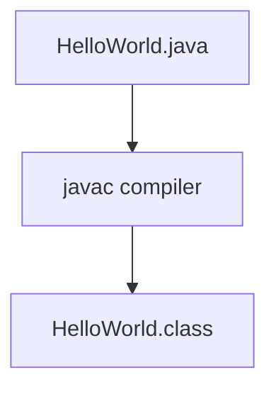

## Creating HelloWorld.java

```java
class HelloWorld {
	public static void main(String[] args) {
		System.out.println("Hello Java!!!");
	}
}
```

## Compilation Flow

When we compile Java program using the *`javac`* compiler, the Java compiler converts the source code into bytecode.



Java Source Code → `HelloWorld.java` 
Java bytecode → `HelloWorld.class `

## Parameter used in HelloWorld.java

1. **class** keyword is used to declare a class in Java.
2. **public** keyword is an access modifier that represent visibility. It means visible to all.
3. **static** is a keyword. If we declare a method as static, it is known as *static method*. The core advantage of the static methods is that there is not need to create and object to invoke the static method. The `main()` method is executed by the JVM, so it doesn’t require creating an object to invoke the `main()` method. So, it saves memory.
4. **void** is the return type of the method. It means it doesn’t return any value.
5. **main** represents the starting point of the program.
6. **`String args[]` or `String[] args`** is used for command line argument.
7. **`System.out.println()`** is used to print statement. Here, System is a class, out is an object of the `PrintStream` class, `println()` is a method of `PrintStream` class.