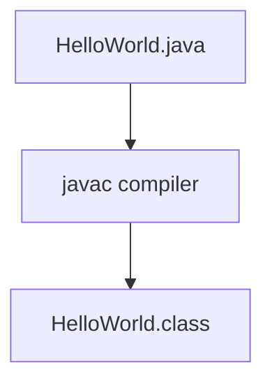
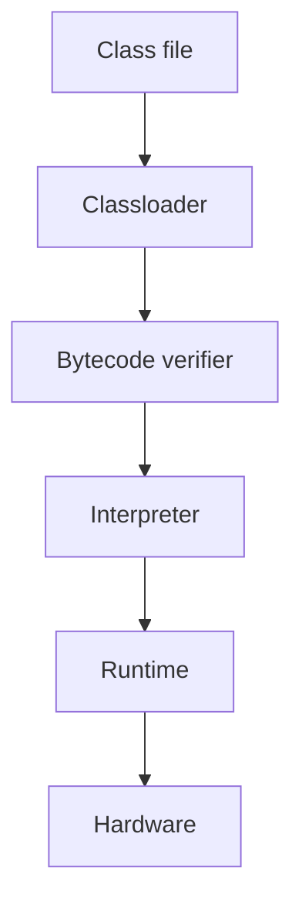

## What happens at compile time?

At compile time, the Java file is compiled by the Java compiler and converts the Java code into bytecode.

Java Source Code → `HelloWorld.java` 
Java bytecode → `HelloWorld.class `

## What happens at runtime?

At runtime, the following steps are performed:

- **`Classloader`**: It is a subsystem of JVM that is used to load class files
- **Bytecode verifier**: Checks the code fragment for illegal code that can violate access rights to objects.
- **Interpreter**: Read bytecode stream then execute the instructions.