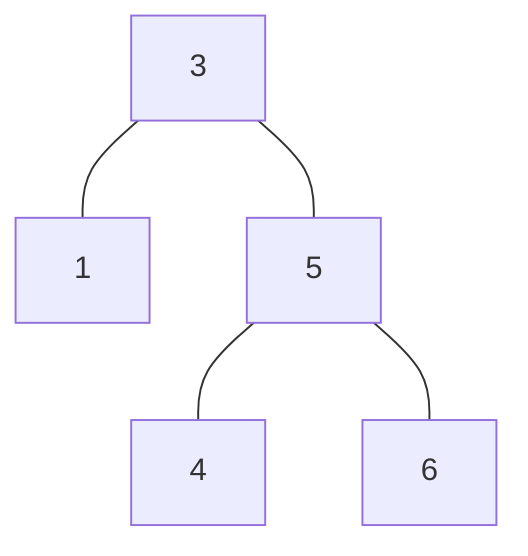
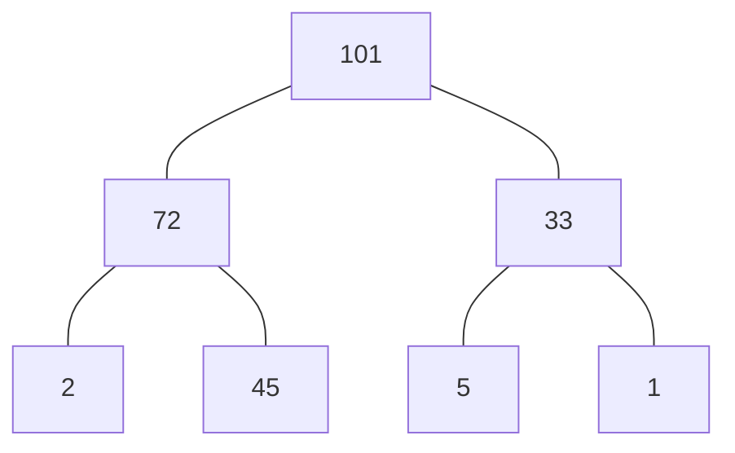
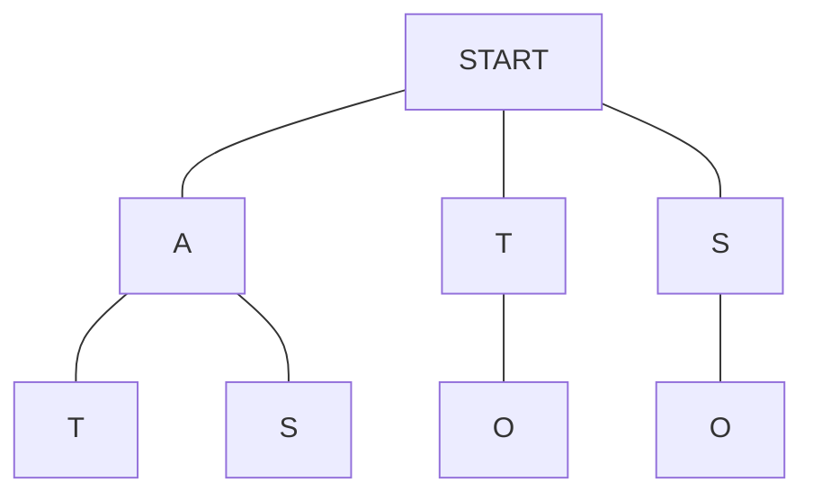

# Trees

Trees are a hierarchical data structure.

Unlike Arrays and Linked List which are linear, Trees can have multiple child nodes.

Trees usually start with a single root node. Every child node descends from this root node.

Nodes in tree have a Parent-Child relationship.

Leaf Nodes are the end node of the Tree data structure.

Trees can also have sub-trees.

Every website is built using Tree data structure.

Every time we write a code and execute it. The machine breaks down the code into Abstract Syntax Tree, so it can understand what we wrote down.

Abstract Syntax Tree uses the Tree data structure.

In a tree data structure, several important terms describe its components and relationships. Here are some key terms:

1. **Node:** A fundamental building block of a tree that contains data and may have a reference to one or more child nodes.

2. **Root:** The topmost node in a tree, from which all other nodes are descended. A tree has only one root.

3. **Parent:** A node in a tree that has one or more child nodes.

4. **Child:** A node in a tree that has a parent node.

5. **Leaf:** A node in a tree that has no children, i.e., it is a terminal node.

6. **Siblings:** Nodes that share the same parent in a tree.

7. **Subtree:** A tree formed by a node and all its descendants.

8. **Depth:** The level or distance of a node from the root. The root is at depth 0, and its children are at depth 1, and so on.

9. **Height:** The length of the longest path from a node to a leaf. The height of the tree is the height of the root node.

10. **Binary Tree:** A tree in which each node has at most two children, typically referred to as the left child and the right child.

11. **Binary Search Tree (BST):** A binary tree in which the left subtree of a node contains only nodes with values less than the node's value, and the right subtree contains only nodes with values greater than the node's value.

12. **Traversal:** The process of visiting all the nodes in a tree in a specific order. Common traversal methods include in-order, pre-order, and post-order.

13. **Balanced Tree:** A tree in which the heights of the two child subtrees of any node differ by at most one.

14. **Forest:** A collection of disjoint trees.

15. **Parental Relationship:** The relationship between a node and its parent.

Understanding these terms is crucial for working with tree data structures and algorithms.

## Binary Tree

A binary tree is a hierarchical data structure in which each node has at most two children, referred to as the left child and the right child. The topmost node in a binary tree is called the root. The nodes that have no children are called leaves. 

Here's an example of a simple binary tree:

```
    1
   / \
  2   3
 / \
4   5
```

In this example:
- Node 1 is the root.
- Node 2 is the left child of the root.
- Node 3 is the right child of the root.
- Nodes 4 and 5 are the left and right children of node 2, respectively.

Binary trees can have various forms and structures depending on how nodes are arranged. They are widely used in computer science for various applications, such as representing hierarchical structures, searching, sorting, and expression parsing.

Binary trees can also be classified based on their balance. A balanced binary tree is one in which the height of the two child subtrees of any node differs by no more than one. Examples of balanced binary trees include AVL trees and Red-Black trees.

Understanding binary trees is fundamental to various algorithms and data structures in computer science.

Rules of Binary Tree -

1. Each node can have only 0, 1 or 2 child nodes.
2. Each child node can have only 1 parent node.




### Perfect Binary Tree

A full binary tree, also known as a perfect binary tree, is a type of binary tree in which every level is completely filled, except possibly for the last level, and all nodes are as left as possible. In other words, a full binary tree is a binary tree in which each node has either 0 or 2 children. If a node has 1 child, then it must be the left child.

Here are some characteristics of a full binary tree:

1. **Node Structure:**
   - Each node in a full binary tree has either 0 or 2 children.
   - If a node has a child, it must be either a left child or a right child.

2. **Levels:**
   - All levels of the tree are completely filled except possibly for the last level.
   - If the last level is not completely filled, all nodes in that level are positioned as left as possible.

3. **Count of Nodes:**
   - If a full binary tree has height \(h\), then it contains \(2^{h+1} - 1\) nodes.
   - Here, \(h\) is the height of the tree, where the height of a tree is the length of the longest path from the root node to a leaf node.

4. **Example:**
   - For example, a binary tree with height \(h=2\) would have \(2^{2+1} - 1 = 2^3 - 1 = 8 - 1 = 7\) nodes if it is a full binary tree.

Here's an example of a full binary tree with height \(h = 2\):

```
        1
       / \
      2   3
     / \
    4   5
```

In this example, every level is filled, and all nodes are as left as possible.

A Perfect Binary tree is very efficient and desirable. The number of nodes double as we go down a level.

Another property is that -

All the nodes above + 1 = Bottom Level

If we consider Perfect Binary Tree in point (a)  
```
3 + 1 = 4  
4 = 4
```

Which implies about half the nodes are in the last level.

In a Perfect Binary Tree, the number of nodes can be calculated by knowing the number of levels in the Perfect Binary Tree as follows 2^(Level) - 1.

For example -  
If the there are three level in Perfect Binary Tree,  
No. of nodes = 2^3 - 1  
No. of nodes = 8 - 1 = 7

### Binary Search Tree

Binary Search Tree is the most commonly used Binary Tree data structure.

Binary Search Tree allows us to preserve the relationship between nodes.

All the child nodes to the right of the current node must be greater than the current node.

All the child nodes to the left of the current node must be lesser than the current node.

Each node can only have up to 2 child nodes because a Binary Search Tree is a Perfect Binary Tree.

Here's an example of a Binary Search Tree:

```
       8
      / \
     3   10
    / \    \
   1   6    14
      / \   /
     4   7  13
```

In this example, for any node \(n\), all nodes in its left subtree have values less than \(n\), and all nodes in its right subtree have values greater than \(n\). For instance, the left subtree of the root node (8) contains nodes with values (3, 1, 6, 4, 7), all of which are less than 8.

The BST property ensures efficient searching. For example, to find a value in the tree, you can start at the root and recursively follow the left or right child based on whether the value is less than or greater than the current node's value.

BST(Binary Search Tree) can be either Balanced or Unbalanced.

Unbalanced BST will have a huge chunk of its nodes on one side instead of being spread out.

It's important to note that if a BST becomes unbalanced (i.e., degenerates into a linked list), the time complexity of operations may degrade, and it might be necessary to rebalance the tree using techniques like AVL trees or Red-Black trees. These balancing techniques ensure that the tree remains relatively balanced, maintaining efficient search and update operations.

AVL Tree and Red Black Tree allows us to make sure that are BSTs are balanced.
#### Time Complexity

##### Balanced Binary Search Tree

1. LOOKUP - O(log N).
2. INSERT - O(log N).
3. DELETE - O(log N).

##### Unbalanced Binary Search Tree

1. LOOKUP - O(N).
2. INSERT - O(N).
3. DELETE - O(N).

#### What are BST good for?

1. Better than O(n) if Balanced.
2. Ordered.
3. Flexible Size.

#### What are BST bad for?

1. No O(1) operations.

#### Implementation

1. Implementing a Binary Search Tree - [Github Link](https://github.com/grandeurkoe/data-structures-and-algorithms/tree/14eca8b788c1c2c7eeb26019018cfc57e9481478/data-structures/trees/implementing-a-binary-search-tree)

## Binary Heap

In Binary Heap, every child belongs to a parent node that has a higher priority or value.



The above is an example of Max Heap.

In a Min Heap, the root values are smaller.

Heaps are used in any algorithm where ordering is important.

Heaps are commonly used in Priority Queues.

Insertion in Binary Heap happens from left to right.

In Priority Queue, each element is assigned a priority.

Elements with a higher priority are inserted first.

### Time Complexity

1. LOOKUP - O(N).
2. INSERT - O(log N).
3. DELETE - O(log N).

### What are Binary Heaps good for?

1. Better than O(n).
2. Priority.
3. Flexible Size.
4. Fast Insert.

### What are Binary Heaps bad for?

1. Slow lookup.

## Trie

Trie is a specialized tree used in searching.

Trie is most often used with texts.

Trie allows you to know if a word or part of a word exists in a  body of text.

Trie has an empty root node.

This root node is the starting point.

Each node can have multiple children i.e., it is not restricted to only two children.



Often used to solve problems associated with strings.

Trie's are used for autocompletion.

Big O of Trie - O(length of word). Where the length of the word is the word that needs to be searched.

Trie is also called Prefix Tree.

The Space complexity of Trie is good because letter are stored in one location and their children are simply linked to this letter.