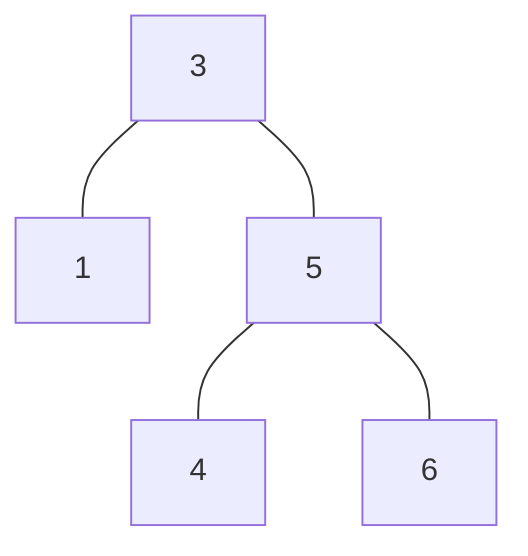
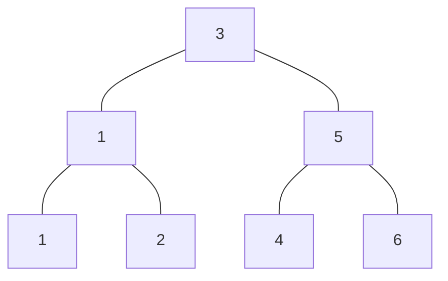
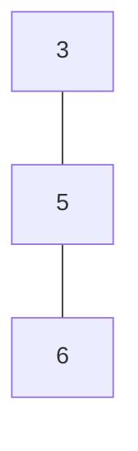
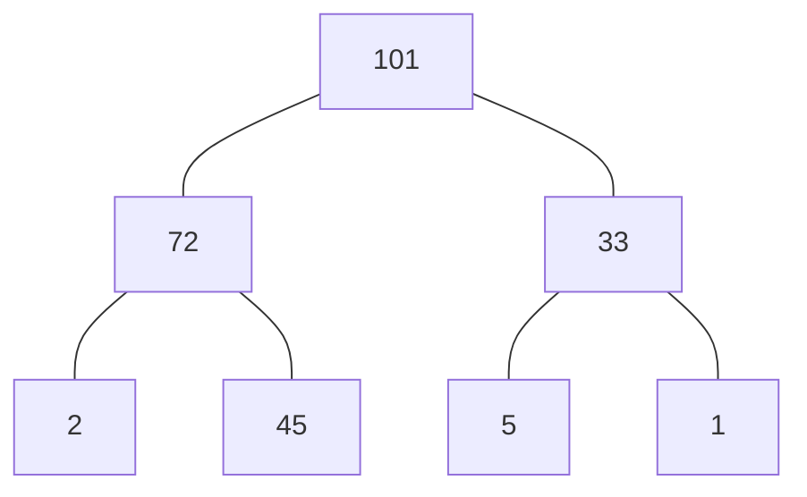
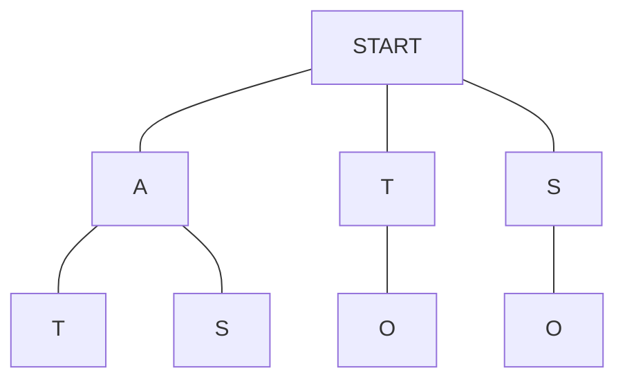

# Trees

Trees are a hierarchical data structure.

Unlike Arrays and Linked List which are linear, Trees can have multiple child nodes.

Trees usually start with a single root node. Every child node descends from this root node.

Nodes in tree have a Parent-Child relationship.

Leaf Nodes are the end node of the Tree data structure.

Trees can also have sub-trees.

Every website is built using Tree data structure.

Every time we write a code and execute it. The machine breaks down the code into Abstract Syntax Tree, so it can understand what we wrote down.

Abstract Syntax Tree uses the Tree data structure.

## Binary Tree

Rules of Binary Tree -

1. Each node can have only 0, 1 or 2 child nodes.
2. Each child node can have only 1 parent node.

A Full Binary Tree only requires each node to either have 0 or 2 child nodes.

### Perfect Binary Tree

A Perfect Binary Tree is a tree which is full i.e., all the leaf node full. A node either has 0 children or 2 children. Also, the bottom layer is completely filled.

A Perfect Binary tree is very efficient and desirable. The number of nodes double as we go down a level.

Another property is that -

All the nodes above + 1 = Bottom Level

If we consider Perfect Binary Tree in point (a)  
3 + 1 = 4  
4 = 4

Which implies about half the nodes are in the last level.

In a Perfect Binary Tree, the number of nodes can be calculated by knowing the number of levels in the Perfect Binary Tree as follows 2^(Level) - 1.

For example -  
If the there are three level in Perfect Binary Tree,  
No. of nodes = 2^3 - 1  
No. of nodes = 8 - 1 = 7

### Binary Search Tree

Binary Search Tree is the most commonly used Binary Tree data structure.

Binary Search Tree allows us to preserve the relationship between nodes.

All the child nodes to the right of the current node must be greater than the current node.

All the child nodes to the left of the current node must be lesser than the current node.

Each node can only have up to 2 child nodes because a Binary Search Tree is a Perfect Binary Tree.

BST(Binary Search Tree) can be either Balanced or Unbalanced.

Unbalanced BST will have a huge chunk of its nodes on one side instead of being spread out.

AVL Tree and Red Black Tree allows us to make sure that are BSTs are balanced.

#### Time Complexity

##### Balanced Binary Search Tree

1. LOOKUP - O(log N).
2. INSERT - O(log N).
3. DELETE - O(log N).

##### Unbalanced Binary Search Tree

1. LOOKUP - O(N).
2. INSERT - O(N).
3. DELETE - O(N).

#### What are BST good for?

1. Better than O(n) if Balanced.
2. Ordered.
3. Flexible Size.

#### What are BST bad for?

1. No O(1) operations.

#### Implementation

1. Implementing a Binary Search Tree - [Github Link](https://github.com/grandeurkoe/data-structures-and-algorithms/tree/4f0a0409009e63683acc86bdb94471532b085e7e/data-structures/trees/implementing-a-binary-search-tree)

## Binary Heap

In Binary Heap, every child belongs to a parent node that has a higher priority or value.

The above is an example of Max Heap.

In a Min Heap, the root values are smaller.

Heaps are used in any algorithm where ordering is important.

Heaps are commonly used in Priority Queues.

Insertion in Binary Heap happens from left to right.

In Priority Queue, each element is assigned a priority.

Elements with a higher priority are inserted first.

### Time Complexity

1. LOOKUP - O(N).
2. INSERT - O(log N).
3. DELETE - O(log N).

### What are Binary Heaps good for?

1. Better than O(n).
2. Priority.
3. Flexible Size.
4. Fast Insert.

### What are Binary Heaps bad for?

1. Slow lookup.

## Trie

Trie is a specialized tree used in searching.

Trie is most often used with texts.

Trie allows you to know if a word or part of a word exists in a  body of text.

Trie has an empty root node.

This root node is the starting point.

Each node can have multiple children i.e., it is not restricted to only two children.

Often used to solve problems associated with strings.

Trie's are used for autocompletion.

Big O of Trie - O(length of word). Where the length of the word is the word that needs to be searched.

Trie is also called Prefix Tree.

The Space complexity of Trie is good because letter are stored in one location and their children are simply linked to this letter.